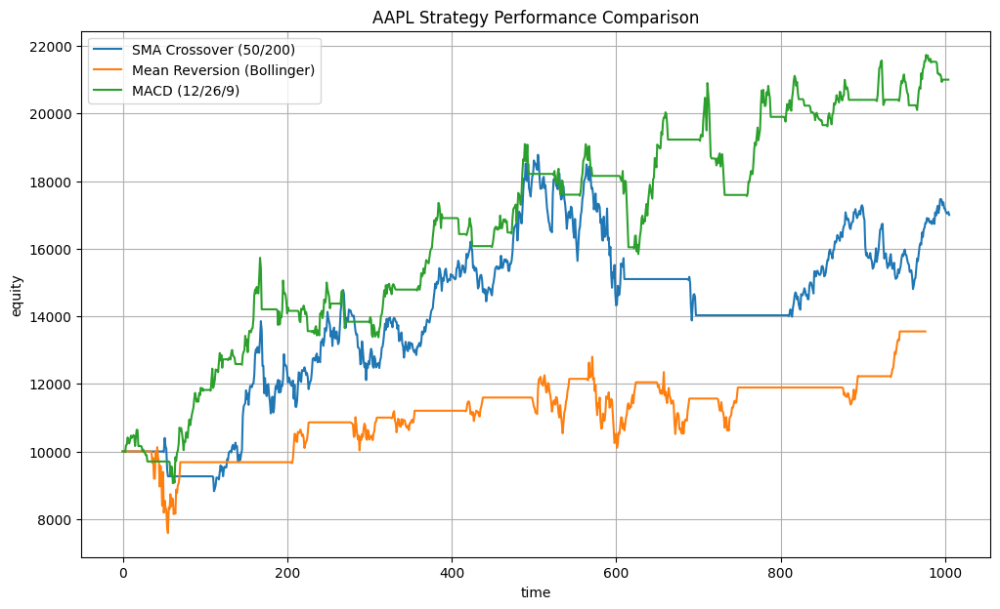

# Python Quantitative Backtesting Engine

An object-oriented, event-driven backtesting engine built in Python. This system simulates algorithmic trading strategies against historical equities data, accounting for realistic market conditions including transaction costs and slippage.

## Overview
This project was designed to demonstrate clean software architecture and modularity in quantitative finance. The execution engine is completely decoupled from the strategy logic, allowing for rapid deployment and testing of new quantitative models without altering the core accounting mechanics.

## Strategy Comparison Results
This backtest evaluates three distinct quantitative models against Apple (AAPL) historical data from 2020 to 2024. The simulation starts with $10,000 capital and factors in a 0.1% commission and 0.1% slippage per trade to reflect realistic market friction.

### Implemented Strategies
* **MACD (12/26/9):** A trend-following momentum strategy utilizing exponential moving averages.
* **Mean Reversion (Bollinger Bands):** A volatility-based strategy assuming extreme price movements revert to the historical average.
* **SMA Crossover (50/200):** A classic macroeconomic trend-following model.

## Core Architecture
* `src/engine.py`: The core execution loop managing order fills, dynamic fractional position sizing, and capital constraints.
* `src/portfolio.py`: Handles portfolio accounting, deducting commission fees, applying slippage penalties, and tracking the mark-to-market equity curve.
* `src/metrics.py`: Calculates essential risk-adjusted performance metrics, specifically the Sharpe Ratio and Maximum Drawdown.
* `strategies/base_strategy.py`: An abstract base class enforcing a strict template for all inherited quantitative models.

## Installation and Usage
1. Clone the repository.
2. Create a virtual environment and install dependencies via `pip install -r requirements.txt`.
3. Run `python main.py` to fetch data, execute the comparative backtest, and generate the performance chart.